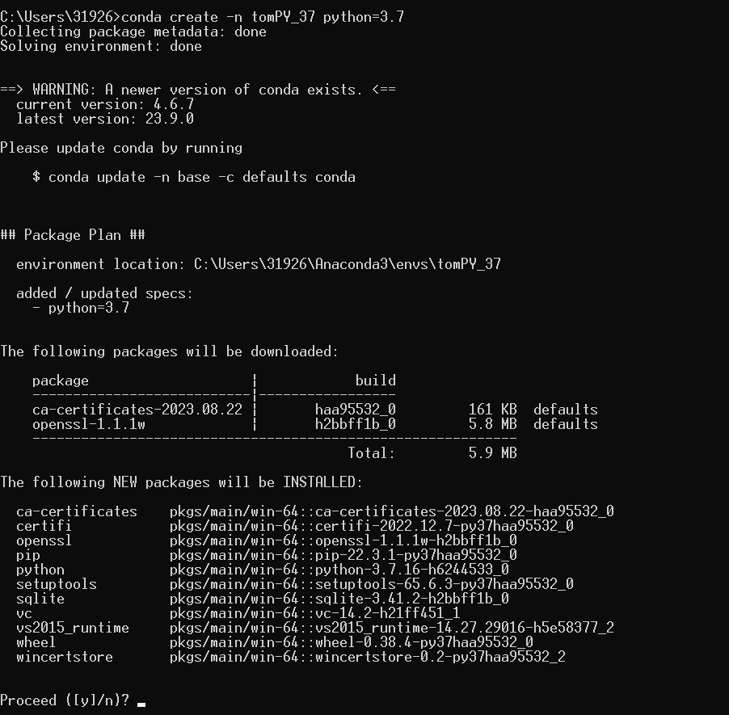

# 开发手册

### 引言

        基于微信小程序与Django后端实现的“漆艺乡村”小程序应用开发，本文档将从0开始记录全部开发过程，包括项目的搭建以及部署上线。


## GitHub

[GitHub - tomauster/qyxc](https://github.com/tomauster/qyxc.git)

## 前端


## 后端

### 技术栈

- Djnago、MySql
  
  

服务器


### Django

参考文档：[django官方文档](./tips/contents.html)

#### 项目搭建


##### 创建虚拟环境

###### **为什么要创建虚拟环境？**

1. 避免依赖冲突：每个项目可能需要不同的Python版本和库，如果不使用虚拟环境，可能会出现依赖冲突的问题，这可能导致项目无法正常运行。

2. 保持项目隔离：使用虚拟环境可以确保项目之间互不影响，即使在同一台服务器上也可以同时运行多个Django项目。

3. 方便共享和备份：使用虚拟环境可以方便地打包和共享项目以及备份整个项目所需的Python环境。

4. 更好的可重复性：使用虚拟环境可以确保项目在任何机器上都能够正常运行，因为每个机器上的环境都是相同的。
   
   

###### **流程**

```python
conda create -n 环境名称 python=版本
```





创建成功！


##### 创建DJANGO项目

下载django3.2.18


###### 创建django项目

django-admin startproject 项目名称


###### 启动django项目

进入tom文件夹后执行

python manage.py runserver

打开浏览器输入

http://127.0.0.1:8000/


##### 在pycharm中打开项目

###### 打开项目路径


###### 设置虚拟环境

file->settings->Project projectname->python InTerpreter


查看以下验证是否成功


#### 项目配置


##### 文件配置


apps：存放app

libs：存放第三方的库文件

utils：存放项目自己定义的公共函数或类等

templates：存放模板文件


##### SETTINGS.PY文件配置

###### 1.允许访问的计算机ip

```
#允许访问的计算机ip
ALLOWED_HOSTS = ['*']
```


###### 2.TEMPLATES

```
TEMPLATES = [
    {
        'BACKEND': 'django.template.backends.django.DjangoTemplates',
        'DIRS': [os.path.join(BASE_DIR, 'templates')],
        'APP_DIRS': True,
        'OPTIONS': {
            'context_processors': [
                'django.template.context_processors.debug',
                'django.template.context_processors.request',
                'django.contrib.auth.context_processors.auth',
                'django.contrib.messages.context_processors.messages',
            ],
        },
    },
]
```


###### 3.DATABASES

```
DATABASES = {
    'default': {
        'ENGINE': 'django.db.backends.mysql',  # mysql引擎
        'NAME': 'web',
        'USER': 'root',
        'PASSWORD': 'Tom786334',
        'HOST': '8.130.76.125',
        'POST': 3306,
    }
}
```


###### 4.LANGUAGE_CODE

```
LANGUAGE_CODE = 'zh-han'
```


###### 5.TIME_ZONE

```
TIME_ZONE = 'Asia/shanghai'
```


### 数据库

#### MySql在服务器上的配置

登录阿里云ecs并远程链接


下载linux版本的mysql

https://www.mysql.com/


准被上传压缩包

使用xhell远程链接后，查看是否安装了lrzsz

若没有则执行安装

```
yum -y install lrzsz
```


##### 安装mysql

```
yum install -y mysql-server
```

设置开机自启动

```
systemctl enable mysqld.service
```

检查开机自启动是否成功

```
systemctl list-unit-files | grep mysqld
```

设置开启服务

```
systemctl start mysqld.service
```

登录

```
##为空就不需要输入
mysql -uroot -p       //密码也就是第九步里面查看到的默认密码
```

修改密码

```
alter user 'root'@'localhost' identified by '123456'; 
```

进入mysql库，设置远程登录

```
#运行下面两句话之后就可以通过root账户远程登陆。
update user set host='%' where user='root';
#命令立即执行生效(千万不要忘记刷新！！！！！)
#这句表示从mysql数据库的grant表中重新加载权限数据
flush privileges;
```


开放对应安全组3306


#### MySql在Django项目中的配置

在setting.py中添加配置

```
DATABASES = {
     'default': {
        'ENGINE': 'django.db.backends.mysql',#mysql引擎
        'NAME': 'web',
        'USER': 'root',
        'PASSWORD': 'Tom786334',
        'HOST': '8.130.76.125',
        'POST': 3306,
    }
}
```


#### 数据库设计

##### 1引言

###### 1.1编写目的

        本数据库设计说明书旨在详细描述和记录我们所开发的数据库系统的设计过程、结构和实施方案。该数据库系统的设计目标是为了满足特定的业务需求，并提供高效、可靠的数据管理和处理能力。

        随着信息技术的不断发展和应用的广泛推广，数据库系统已经成为现代企业和组织中不可或缺的核心组成部分。它们承载着大量的业务数据，并提供了对这些数据的存储、查询、分析和管理功能。因此，一个合理、健壮的数据库设计对于系统的稳定性、性能和可扩展性至关重要。

        本文档将详细介绍我们数据库设计的过程和方法。首先，我们将分析和梳理业务需求，并确定数据实体、属性和关系。然后，我们将使用适当的数据库设计方法，将概念模型转换为逻辑模型，定义数据库的结构和约束。接下来，我们将考虑数据库的物理组织结构、安全性需求和性能优化策略，以确保数据库的高效运行和数据的安全性。


###### 1.2背景

    1.使用此数据库的软件：“漆艺乡村”微信小程序

    2.待开发的数据库名称：web

    3.开发者：

    4.使用者：面向全体社会成员


###### 1.3定义

| 词汇名称   | 词汇定义                                                                   | 备注                              |
| ------ | ---------------------------------------------------------------------- | ------------------------------- |
| C/S    | 客户端/服务器                                                                | Client/Server                   |
| SQL    | SQL(Structured Query Language)是一种数据库查询和程序设计语言，用于存取数据以及查询、更新和管理关系数据库系统。 |                                 |
| Django | Django是一个开放源代码的Web应用框架，由Python写成                                       | Django采用了MVT的框架模式，即模型M，视图V和模版T。 |
| E-R图   | 实体-联系图，提供了表示实体类型、属性和联系的方法，用来描述现实世界的概念模型。                               | Entity -Relationship            |


##### 2外部设计

###### 2.1标识符和状态

数据库软件的名称：Mysql 8.0.32

数据库的名称：web

| 表名  | 标识符或名称 | 描述信息 | 状态  |
| --- | ------ | ---- | --- |
|     |        |      |     |
|     |        |      |     |
|     |        |      |     |

###### 2.2使用它的程序

| 应用程序 | 访问的数据表 | 版本号 |
| ---- | ------ | --- |
|      |        |     |
|      |        |     |
|      |        |     |

###### 2.3约定

| 文卷  | 记录  | 数据项的命名约定 |
| --- | --- | -------- |
|     |     |          |
|     |     |          |
|     |     |          |

###### 2.4专门指导

###### 2.5支持软

| 支持软件名称 | 版本号    | 主要功能                |
| ------ | ------ | ------------------- |
| Django | 3.2.18 | 后端框架，为小程序提供数据库的技术支持 |
| Python | 3.7    | 后端代码编写              |
| MySql  | 8.0.32 | 建立数据库并提供数据库维护与管理功能  |
| 微信小程序  |        | 前端页面设计开发            |


##### 3结构设计

###### 3.1概念结构设计

###### 3.2逻辑结构设计

###### 3.3物理结构设计


##### 4运用设计

###### 4.1数据字典设计

###### 4.2安全保密设计


